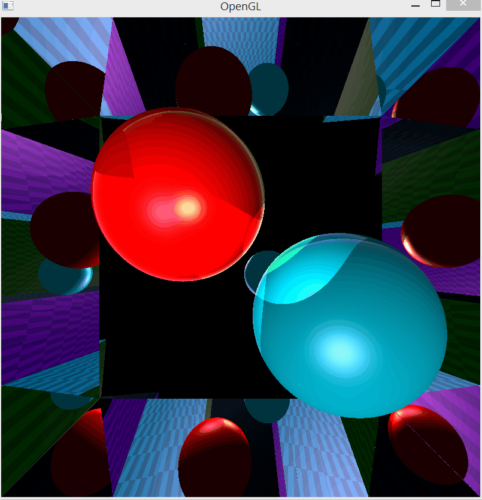

Created during computer graphics course.

Based on 3D engine from:
https://github.com/tamirgrBGU/EngineForCGcourse

This project mainly presents a ray tracing shader written in GLSL:
https://github.com/MElishaev/Raytracing_OpenGL/blob/main/res/shaders/myShader.glsl

Based on Phong ligthing model.

## Sample
  
